# PCB Design Portfolio | Altium Designer 2025

Professional Printed Circuit Board designs created with **Altium Designer 2025**.

## 📊 Project Summary
- **6 × 2-Layer PCBs**
- **1 × 4-Layer PCB**
- **Total:** 7 PCB Designs
- **Software:** Altium Designer 2025

## ✨ Features
- Complete schematic design and capture
- Professional multi-layer PCB layout
- Optimized component placement and routing
- Design Rule Check (DRC) passed
- 3D visualization and mechanical checks
- Manufacturing-ready outputs (Gerber, Drill, BOM)

## 📁 Projects Included
- **6 Two-Layer Boards** – Compact and cost-effective designs
- **1 Four-Layer Board** – Advanced design with better signal integrity and power distribution

## 🛠️ Project Contents
- `.PrjPcb` → Altium Project files
- `.SchDoc` → Schematic documents
- `.PcbDoc` → PCB layout files
- Gerber files & NC Drill files
- Bill of Materials (BOM)
- 3D STEP models

## 🖼️ Gallery

## 🖼️ Gallery

### 3D Renders
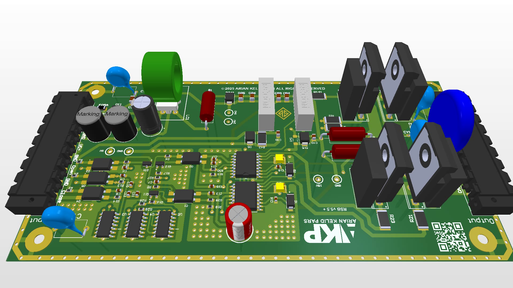

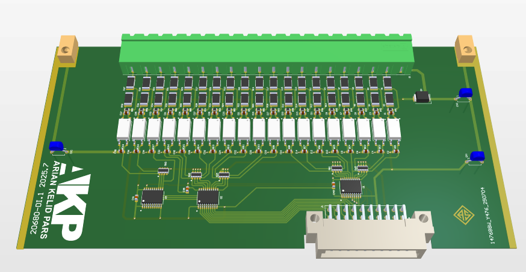
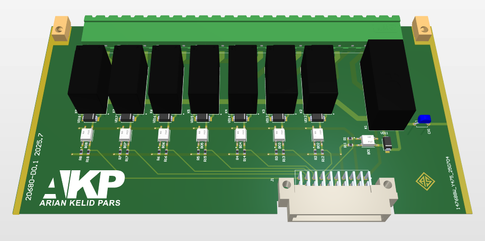
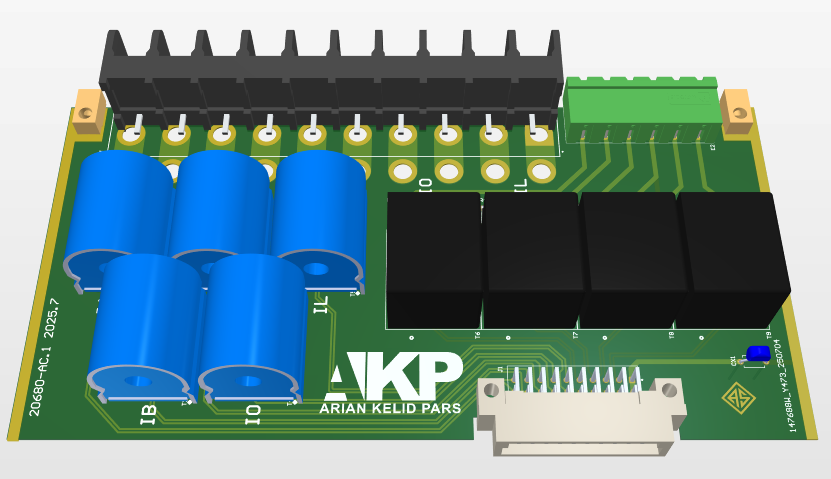
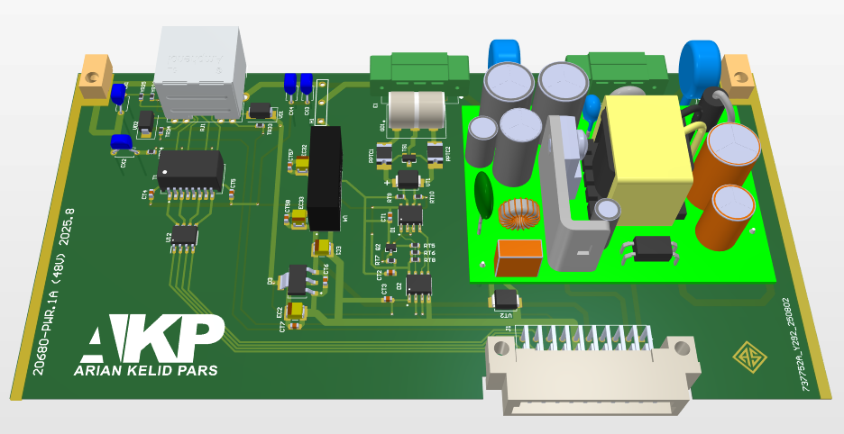
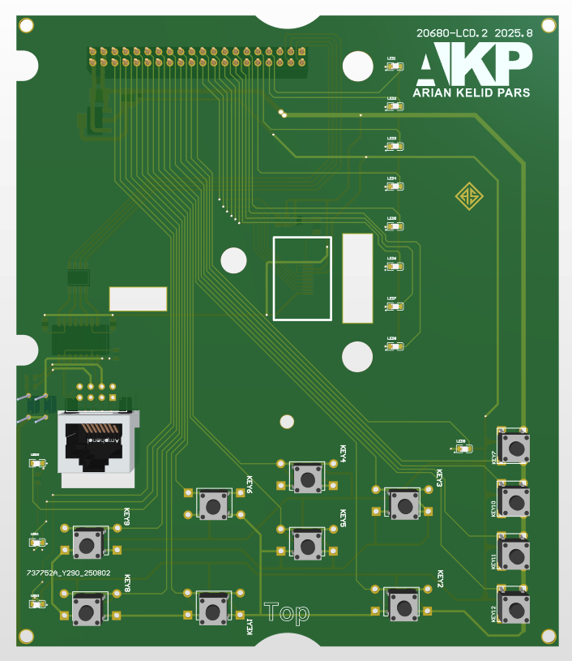

### All PCB Designs

**Relay PCBs:**

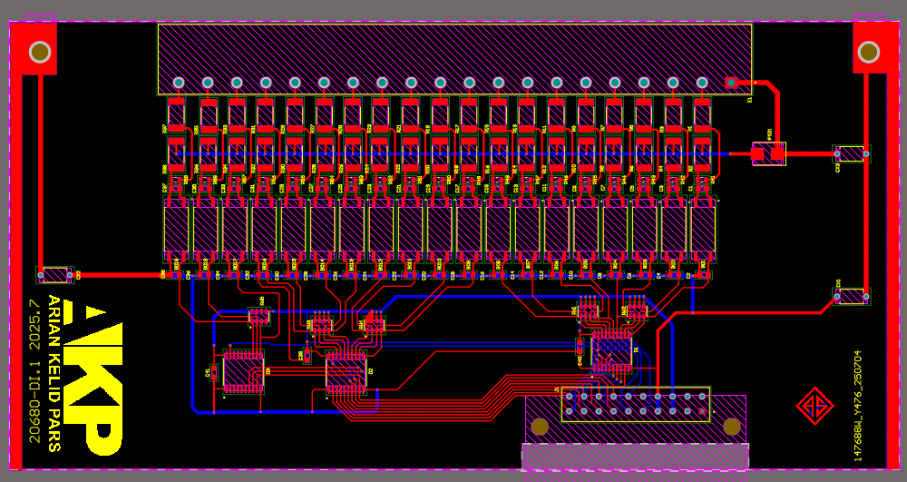
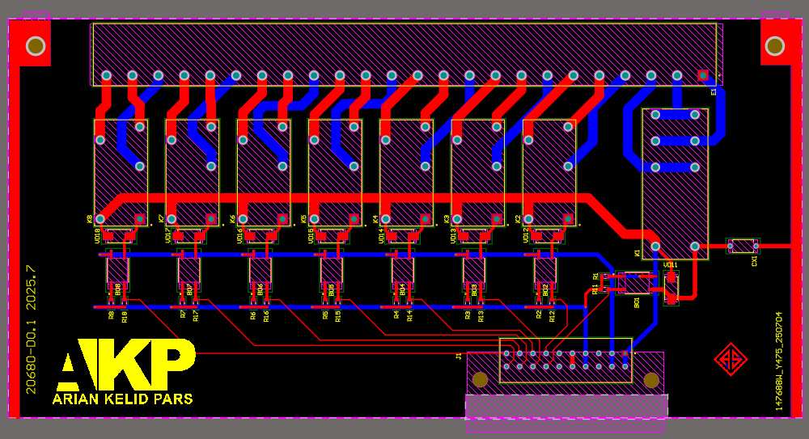
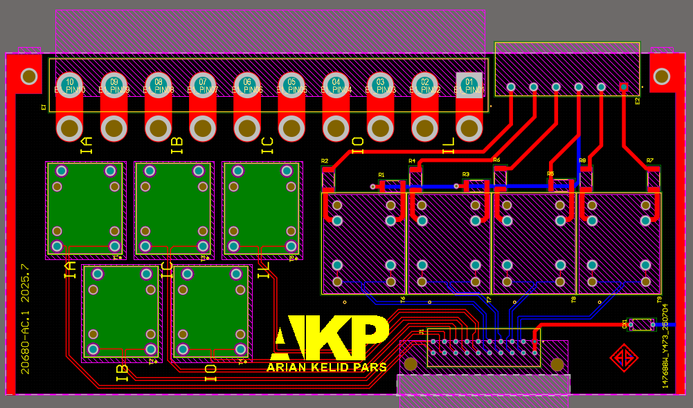
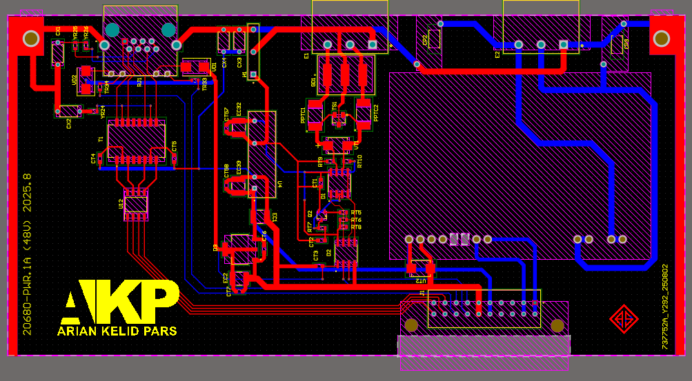
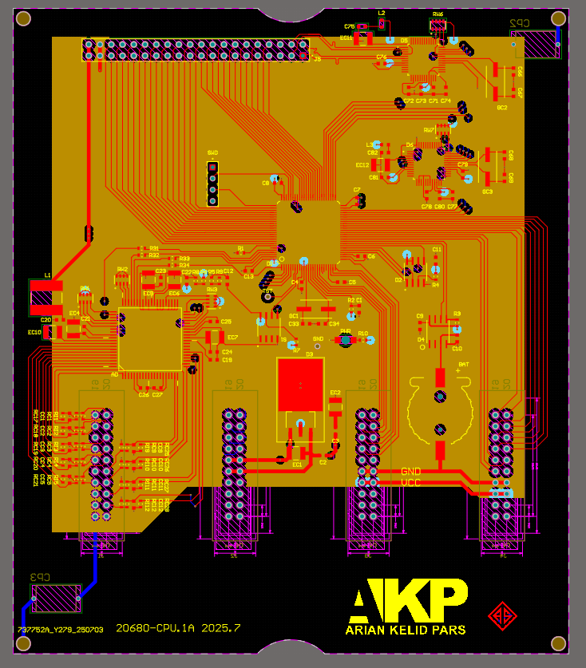
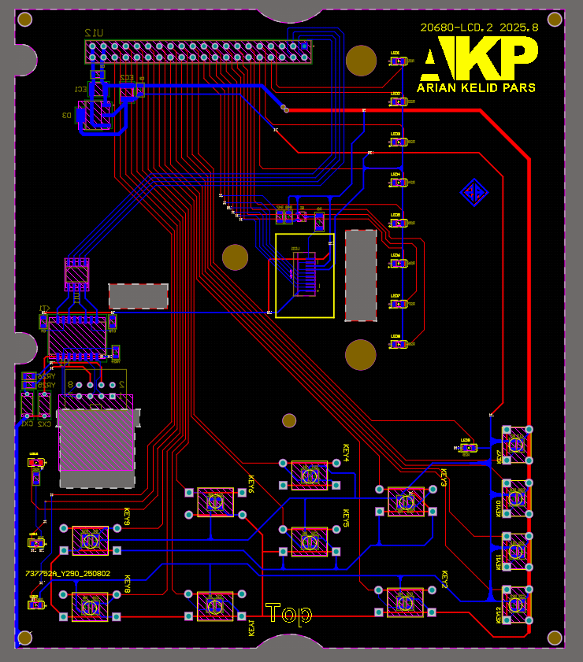

**RSB Board:**

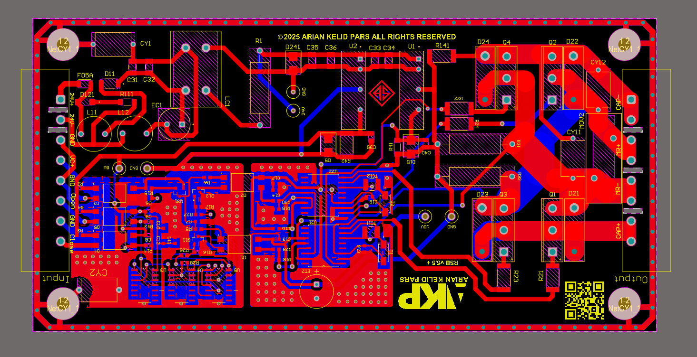

## 🔗 Links
- [My GitHub Profile](https://github.com/Safari-akp)
---

**Made by Alireza Safari**
